# UrbanCap 🛒

A full-featured e-commerce application built with Next.js 15, featuring product management, payments, and a comprehensive admin dashboard.

**🎓 Educational Purpose Only**  
This project is designed for learning and portfolio demonstration purposes. It uses sandbox/test payment integrations and has limitations outlined below.

**🌐 Live Demo:** [https://cap-vault.vercel.app/](https://cap-vault.vercel.app/)

---

## 📋 Table of Contents

1. ✨ [Features](#features)
2. ⚠️ [Limitations](#limitations)
3. 🛠️ [Tech Stack](#tech-stack)
4. 📦 [Prerequisites](#prerequisites)
5. 🚀 [Installation](#installation)
6. 🔐 [Environment Variables](#environment-variables)
7. 🗄️ [Database Setup](#database-setup)
8. 🏃 [Running the Project](#running-the-project)
9. 📸 [Screenshots](#screenshots)
10. 👤 [Author](#author)

---

## Features

### Customer Features

- **Product Browsing** - Browse through a comprehensive product catalog
- **Search & Filtering** - Filter products by price range, category, and customer ratings
- **Shopping Cart** - Add, update, and remove items from cart
- **User Authentication** - Secure login and registration using NextAuth
- **Multiple Payment Methods** - Choose between:
  - Stripe
  - PayPal
  - Cash on Delivery
- **Order Management** - View order history
- **Email Purchase Receipts** - Automatic purchase receipt generation and delivery after successful payment
- **Product Reviews** - Read and write product reviews with ratings
- **Profile Management** - Update personal information and preferences

### Admin Features

- **Admin Dashboard** - Comprehensive management interface
- **User Management** - View, edit, and manage user accounts
- **Product Management** - Create, update, delete, and organize products
- **Order Management** - Process and track all customer orders
- **Image Upload** - Upload and manage product images via UploadThing

---

## Limitations

Please be aware of the following limitations in this educational project:

### Email Service (Resend)

- **Free Tier Restriction**: Purchase receipts can only be sent to email addresses that are registered and verified in your Resend account
- For testing, you'll need to verify recipient email addresses in your Resend dashboard

### Payment Processing

- **Sandbox/Test Mode**: Both PayPal and Stripe are configured for test/sandbox environments only
- No real payments are processed
- Use test card numbers and PayPal sandbox credentials for testing

### General

- This project is intended for learning, skill demonstration, and portfolio purposes

---

## Tech Stack

- **Framework**: [Next.js 15](https://nextjs.org/) (App Router)
- **Language**: TypeScript
- **Database**: [Neon](https://neon.tech/) (Serverless Postgres)
- **ORM**: [Prisma](https://www.prisma.io/)
- **UI Components**: [shadcn/ui](https://ui.shadcn.com/)
- **Styling**: Tailwind CSS
- **Authentication**: [NextAuth.js](https://next-auth.js.org/)
- **Payment Gateways**:
  - [Stripe](https://stripe.com/)
  - [PayPal](https://www.paypal.com/)
- **File Upload**: [UploadThing](https://uploadthing.com/)
- **Email Service**: [Resend](https://resend.com/)
- **Package Manager**: pnpm

---

## Prerequisites

Before you begin, ensure you have the following installed:

- **Node.js** (v18 or higher)
- **pnpm** (recommended) or npm
- **Git**
- A **Neon** database account (or PostgreSQL database)
- **Resend** account for email services
- **Stripe** account (test mode)
- **PayPal** developer account (sandbox)
- **UploadThing** account for image uploads

---

## Installation

### 1. Clone the Repository

```bash
git clone https://github.com/jfsar/cap-vault.git
cd cap-vault
```

### 2. Install Dependencies

```bash
pnpm install
# or
npm install
```

### 3. Set Up Environment Variables

Create a `.env.local` file in the root directory and add the required environment variables (see [Environment Variables](#environment-variables) section below).

---

## Environment Variables

Create a `.env.local` file in the root of your project and add the following variables:

```env
# App Configuration
NEXT_PUBLIC_APP_URL=http://localhost:3000

# Database (Neon or PostgreSQL)
DATABASE_URL=
DB_DIRECT_URL=

# Authentication
AUTH_SECRET=

# Payment Configuration
PAYMENT_METHODS="PayPal, Stripe, CashOnDelivery"
DEFAULT_PAYMENT_METHOD=PayPal

# PayPal (Sandbox)
PAYPAL_CLIENT_ID=
PAYPAL_APP_SECRET=
PAYPAL_API_URL=https://api-m.sandbox.paypal.com

# Stripe (Test Mode)
NEXT_PUBLIC_STRIPE_PUBLISHABLE_KEY=
STRIPE_SECRET_KEY=

# UploadThing
UPLOADTHING_TOKEN=
UPLOADTHING_SECRET=
UPLOADTHING_APP_ID=

# Email (Resend)
RESEND_API_KEY=
SENDER_EMAIL="onboarding@resend.dev"

# User Roles
USER_ROLES="admin, user"
```

### How to Get API Keys:

- **Neon Database**: Sign up at [neon.tech](https://neon.tech/) and create a new project
- **NextAuth Secret**: Generate with `openssl rand -base64 32`
- **PayPal**: Get sandbox credentials from [PayPal Developer Dashboard](https://developer.paypal.com/)
- **Stripe**: Get test keys from [Stripe Dashboard](https://dashboard.stripe.com/test/apikeys)
- **UploadThing**: Create an app at [uploadthing.com](https://uploadthing.com/)
- **Resend**: Get API key from [resend.com](https://resend.com/)

---

## Database Setup

### Option 1: Using Neon Database (Recommended)

1. Visit [neon.tech](https://neon.tech/) and create a free account
2. Create a new project
3. Copy the connection string and add it to your `.env.local` file as `DATABASE_URL` and `DB_DIRECT_URL`

### Option 2: Local PostgreSQL

Set up your own PostgreSQL database and update the connection strings in `.env.local`

### Initialize prisma client

```bash
npx prisma generate
```

### Run Migrations

```bash
npx prisma migrate dev --name init
```

### Seed the Database

```bash
pnpm run seed
```

This will populate your database with initial data including sample products, categories, and users.

### View Database (Optional)

```bash
npx prisma studio
```

---

## Running the Project

### Development Mode

```bash
pnpm dev
# or
npm run dev
```

Open [http://localhost:3000](http://localhost:3000) in your browser.

### Build for Production

```bash
pnpm build
# or
npm run build
```

### Start Production Server

```bash
pnpm start
# or
npm start
```

---

## Screenshots

### Homepage

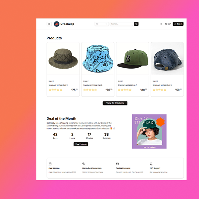

### Product Listing

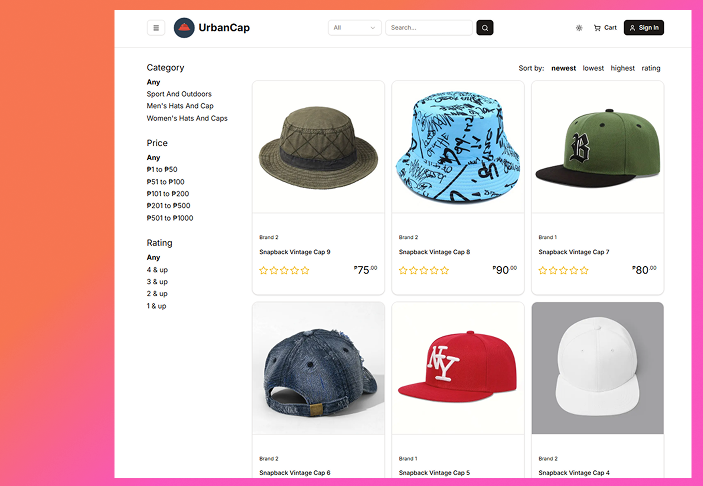

### Product Page

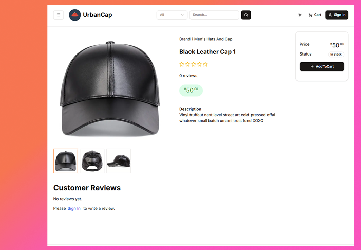

### Shopping Cart

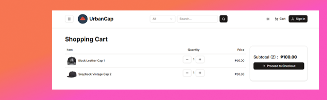

### Shipping Address

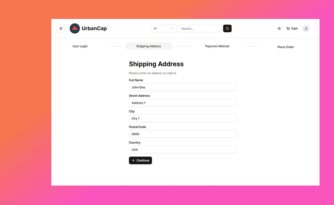

### Payment Method

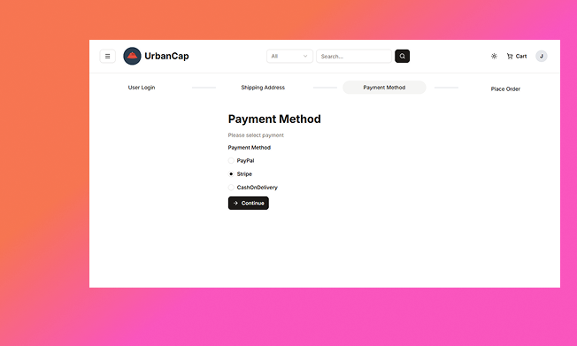

### Place Order

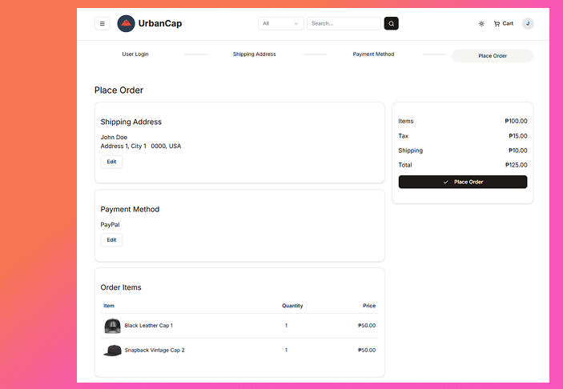

### PayPal Checkout

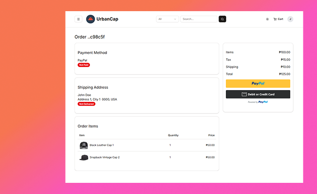

### Stripe Checkout

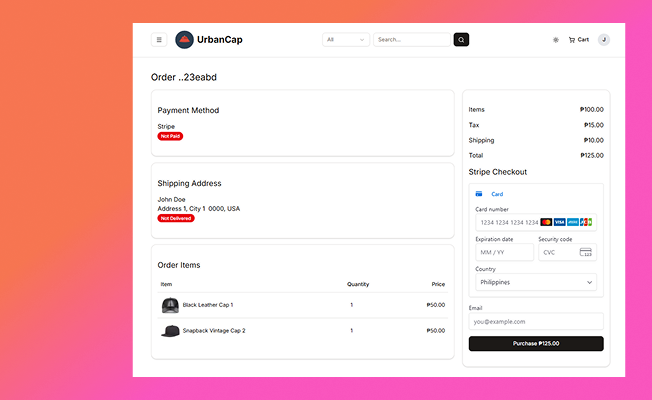

### Admin Dashboard

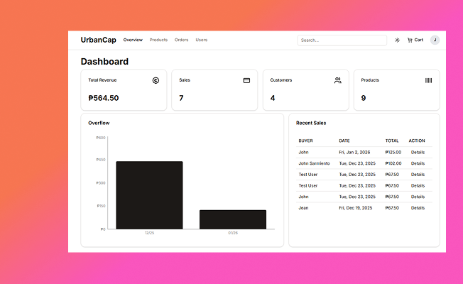

### Order Management

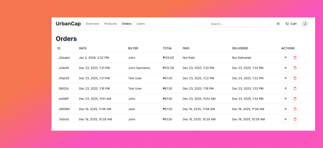

---

## Author

**John Sarmiento**

- GitHub: [@jfsar](https://github.com/jfsar)
- Email: john.sarmiento452@gmail.com

---

## Contact

For questions or feedback, please open an issue on GitHub or contact the author directly.

---

**Happy Coding! 🚀**

_Built with ❤️ for learning and portfolio purposes_
